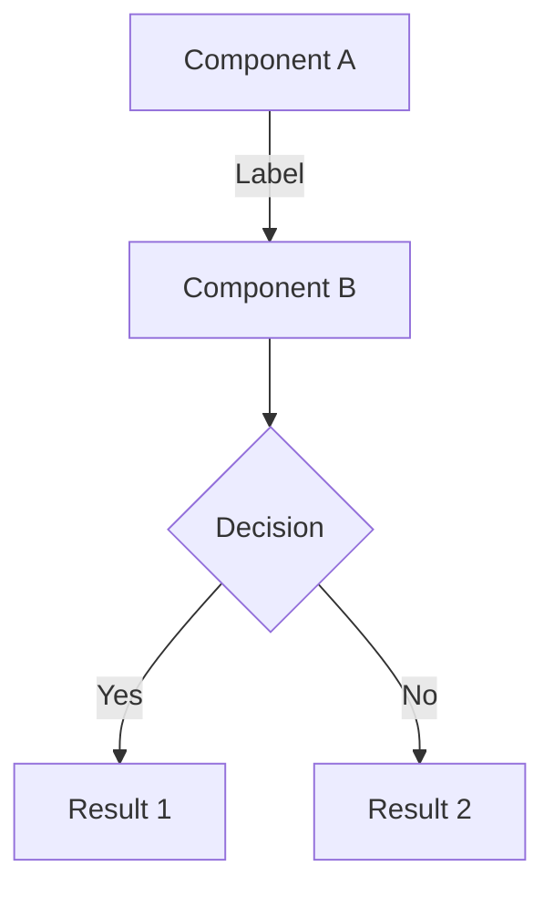
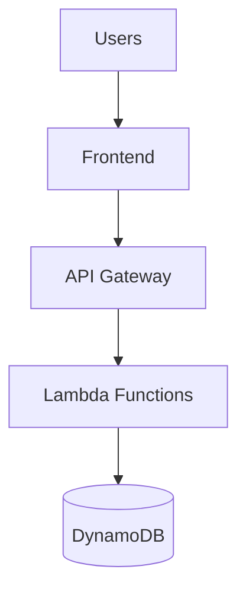

# Architecture Diagram Guide

## Overview

This guide explains how to create, view, edit, and maintain architecture diagrams for the Pinterest Affiliate Platform.

## Available Diagrams

### 1. Mermaid Diagram (Recommended for GitHub)
- **File**: `architecture-diagram.md`
- **Format**: Mermaid markdown
- **Advantages**: 
  - Automatically rendered by GitHub
  - Version control friendly (text-based)
  - Easy to update and maintain
  - No external tools required
- **Disadvantages**:
  - Limited styling options
  - Less visual customization

### 2. Draw.io Diagram (For Detailed Visuals)
- **File**: `architecture-diagram.drawio` (create manually)
- **Format**: Draw.io XML
- **Advantages**:
  - Rich visual customization
  - Professional appearance
  - Detailed component layouts
  - Export to multiple formats
- **Disadvantages**:
  - Requires external tool
  - Binary format (harder to diff)

## Using Mermaid Diagrams

### Viewing

The Mermaid diagram in `architecture-diagram.md` is automatically rendered by GitHub when you view the file in your repository.

### Editing

1. Open `architecture-diagram.md` in any text editor
2. Modify the Mermaid code between the triple backticks
3. Commit and push to see changes on GitHub

### Mermaid Syntax Quick Reference



**Node Shapes**:
- `[Text]` - Rectangle
- `(Text)` - Rounded rectangle
- `{Text}` - Diamond (decision)
- `[(Text)]` - Cylinder (database)
- `((Text))` - Circle

**Connections**:
- `-->` - Arrow
- `---` - Line
- `-.->` - Dotted arrow
- `==>` - Thick arrow

**Subgraphs**:
```mermaid
subgraph "Group Name"
    A[Component 1]
    B[Component 2]
end
```

**Styling**:
```mermaid
classDef className fill:#color,stroke:#color
class A,B className
```

### Resources
- [Mermaid Documentation](https://mermaid.js.org/)
- [Mermaid Live Editor](https://mermaid.live/)
- [GitHub Mermaid Support](https://github.blog/2022-02-14-include-diagrams-markdown-files-mermaid/)

## Creating Draw.io Diagrams

### Option 1: Draw.io Web App (Recommended)

1. **Open Draw.io**
   - Go to https://app.diagrams.net/
   - Click "Create New Diagram"

2. **Choose Template**
   - Select "Blank Diagram" or "AWS Architecture"
   - Name it "Pinterest Affiliate Architecture"

3. **Add Components**
   - Use the left sidebar to drag components
   - AWS shapes available in "AWS" category
   - General shapes in "General" category

4. **Save**
   - File → Save As → Device
   - Save as `architecture-diagram.drawio`
   - Place in repository root

5. **Export PNG**
   - File → Export as → PNG
   - Name it `architecture-diagram.png`
   - Use for README display

### Option 2: Draw.io Desktop App

1. **Download**
   - Visit https://github.com/jgraph/drawio-desktop/releases
   - Download for your OS (macOS, Windows, Linux)
   - Install the application

2. **Create Diagram**
   - Open Draw.io Desktop
   - Create new diagram
   - Add components and connections

3. **Save and Export**
   - Save as `.drawio` file
   - Export as PNG for documentation

### Option 3: VS Code Extension

1. **Install Extension**
   - Open VS Code
   - Search for "Draw.io Integration"
   - Install extension by Henning Dieterichs

2. **Create Diagram**
   - Create new file: `architecture-diagram.drawio`
   - VS Code will open Draw.io editor
   - Edit directly in VS Code

3. **Auto-Save**
   - Changes save automatically
   - Commit to version control

## Draw.io Best Practices

### Component Organization

**Use Layers**:
- Background layer for title and legend
- Separate layers for each system component
- Monitoring and deployment layers

**Color Coding**:
- Green (#d5e8d4) - Frontend & Data
- Orange (#ffe6cc) - API Layer
- Red (#f8cecc) - Compute (Lambda)
- Purple (#e1d5e7) - External Services
- Yellow (#fff2cc) - Monitoring & Auth
- Blue (#dae8fc) - Deployment & CI/CD
- Gray (#f5f5f5) - Infrastructure

**Consistent Styling**:
- Use same font throughout (Helvetica or Arial)
- Consistent font sizes (12pt for labels, 14pt for titles)
- Align components using grid (View → Grid)
- Use connectors with arrows for data flow

### AWS Architecture Icons

**Download Official Icons**:
1. Visit [AWS Architecture Icons](https://aws.amazon.com/architecture/icons/)
2. Download the icon set
3. Import into Draw.io: File → Import → From Device

**Common Icons**:
- Lambda: Orange lambda symbol
- API Gateway: Purple API icon
- DynamoDB: Blue database icon
- S3: Green bucket icon
- CloudFront: Orange CDN icon
- Cognito: Pink user icon

### Layout Tips

**Hierarchical Layout**:
- Users at top
- Frontend layer below users
- API layer in middle
- Compute layer below API
- Data layer at bottom
- External services on right
- Monitoring on left

**Connection Routing**:
- Use orthogonal connectors for clean lines
- Avoid crossing connections when possible
- Group related components
- Use waypoints to route around components

**Labels and Annotations**:
- Label all connections with action/data
- Add component descriptions
- Include version numbers
- Note key configurations

## Updating Diagrams

### When to Update

Update diagrams when you:
- Add new AWS services
- Modify data flow
- Change external integrations
- Add new features
- Update security architecture
- Change deployment processes
- Modify monitoring setup

### Update Process

1. **Identify Changes**
   - Review code changes
   - Check infrastructure updates
   - Note new integrations

2. **Update Mermaid Diagram**
   - Edit `architecture-diagram.md`
   - Add/remove/modify components
   - Update connections and labels
   - Commit changes

3. **Update Draw.io (if exists)**
   - Open `.drawio` file
   - Make corresponding changes
   - Export new PNG
   - Commit both files

4. **Update Documentation**
   - Update `ARCHITECTURE.md`
   - Add new component descriptions
   - Update data flow sections
   - Update quick reference

5. **Commit and Push**
   ```bash
   git add architecture-diagram.md ARCHITECTURE.md
   git commit -m "Update architecture: [describe changes]"
   git push origin main
   ```

## Creating a Draw.io Diagram from Scratch

### Step-by-Step Guide

**1. Set Up Canvas**
- Create new diagram
- Set page size to A3 landscape
- Enable grid (View → Grid)
- Set grid size to 10px

**2. Add Title**
- Insert text box at top
- Title: "Pinterest Affiliate Platform - System Architecture"
- Font: 20pt, bold
- Center align

**3. Create User Layer**
- Add actor shapes for users
- Label: "Public Users" and "Admin Users"
- Position at top of diagram

**4. Add Frontend Layer**
- Create container box
- Label: "Frontend Layer - AWS Amplify"
- Add components:
  - React SPA box
  - CloudFront CDN box
  - Custom domain box
- Connect with arrows

**5. Add API Layer**
- Create container box
- Label: "API Layer"
- Add components:
  - API Gateway box
  - Cognito Authorizer box
- Connect to frontend

**6. Add Compute Layer**
- Create container box
- Label: "Compute Layer - AWS Lambda"
- Add function groups:
  - Product functions
  - User functions
  - Price sync functions
  - Utility functions
- Connect to API layer

**7. Add Data Layer**
- Create container box
- Label: "Data Layer"
- Add components:
  - DynamoDB (cylinder shape)
  - S3 bucket
  - CloudFront CDN
  - Cognito User Pool
  - Parameter Store
- Connect to compute layer

**8. Add External Services**
- Create container box
- Label: "External Services"
- Add components:
  - Amazon PA-API
  - Amazon Associates
  - Google AdSense
  - AWS SES
- Connect to relevant components

**9. Add Monitoring**
- Create container box
- Label: "Monitoring & Operations"
- Add components:
  - CloudWatch
  - Dashboard
  - SNS
  - EventBridge
  - Alarms
- Connect to compute layer

**10. Add Deployment**
- Create container box
- Label: "Deployment & CI/CD"
- Add components:
  - GitHub
  - AWS CDK
  - Amplify CI/CD
- Connect to infrastructure

**11. Add Legend**
- Create small box in corner
- List color meanings
- Add example shapes

**12. Add Metadata**
- Add text box with:
  - Production URLs
  - AWS Resource IDs
  - Key metrics
  - Last updated date

**13. Final Touches**
- Align all components
- Ensure consistent spacing
- Check all connections
- Verify labels are readable
- Add any missing annotations

**14. Export**
- File → Export as → PNG
- Resolution: 300 DPI
- Transparent background: No
- Border width: 10px
- Save as `architecture-diagram.png`

## Display in GitHub

### README Integration

Add to your `README.md`:

```markdown
## System Architecture


*For detailed architecture documentation, see [ARCHITECTURE.md](./ARCHITECTURE.md)*

*To view the interactive Mermaid diagram, see [architecture-diagram.md](./architecture-diagram.md)*
```

### Mermaid in README

You can also embed Mermaid directly in README:

```markdown
## System Architecture


```

GitHub will automatically render the diagram.

## Troubleshooting

### Mermaid Not Rendering

**Issue**: Diagram shows as code block
- **Solution**: Ensure you're viewing on GitHub (not local markdown viewer)
- **Alternative**: Use [Mermaid Live Editor](https://mermaid.live/) to preview

**Issue**: Syntax error in diagram
- **Solution**: Check Mermaid syntax
- **Tool**: Paste code into Mermaid Live Editor to debug

### Draw.io Issues

**Issue**: File won't open
- **Solution**: Ensure using latest Draw.io version
- **Alternative**: Try web version at app.diagrams.net

**Issue**: Export quality poor
- **Solution**: Increase DPI in export settings (300+ recommended)
- **Format**: Use PNG for photos, SVG for scalable graphics

**Issue**: Icons missing
- **Solution**: Download AWS icon set and import
- **Alternative**: Use basic shapes with labels

### Version Control

**Issue**: Draw.io file shows as binary in diff
- **Solution**: This is normal for .drawio files
- **Workaround**: Export PNG and commit both files
- **Best Practice**: Add descriptive commit messages

## Advanced Features

### Interactive Diagrams

**Clickable Links**:
- Right-click component → Edit Link
- Add URL to AWS console or documentation
- Export as HTML for interactive version

**Tooltips**:
- Right-click component → Edit Tooltip
- Add detailed information
- Visible on hover in HTML export

### Automation

**Generate from Code**:
- Use tools like [Diagrams](https://diagrams.mingrammer.com/) (Python)
- Generate Mermaid from infrastructure code
- Keep diagrams in sync with code

**CI/CD Integration**:
- Auto-generate diagrams on deployment
- Validate diagram syntax in CI pipeline
- Auto-commit updated diagrams

### Multiple Views

**Create Different Diagrams**:
- High-level overview (for executives)
- Detailed technical (for developers)
- Security architecture (for security team)
- Data flow (for data engineers)
- Deployment pipeline (for DevOps)

## Resources

### Tools
- [Draw.io Web](https://app.diagrams.net/)
- [Draw.io Desktop](https://github.com/jgraph/drawio-desktop/releases)
- [Mermaid Live Editor](https://mermaid.live/)
- [AWS Architecture Icons](https://aws.amazon.com/architecture/icons/)

### Documentation
- [Mermaid Documentation](https://mermaid.js.org/)
- [Draw.io Documentation](https://www.diagrams.net/doc/)
- [AWS Architecture Best Practices](https://aws.amazon.com/architecture/well-architected/)

### Examples
- [AWS Architecture Diagrams](https://aws.amazon.com/architecture/)
- [Mermaid Examples](https://mermaid.js.org/syntax/examples.html)
- [Draw.io Templates](https://www.diagrams.net/blog/aws-diagrams)

---

*This guide helps maintain clear, up-to-date architecture documentation for the Pinterest Affiliate Platform.*
