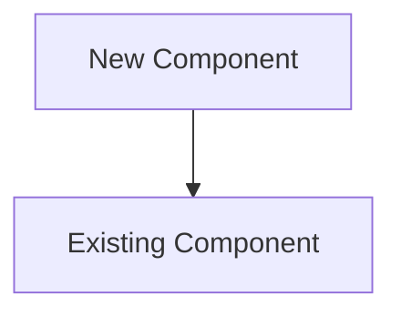

# Architecture Documentation - Complete Package

## 📦 What's Included

Your Pinterest Affiliate Platform now has a complete architecture documentation package:

### Core Documentation
1. **ARCHITECTURE.md** - Comprehensive architecture documentation
   - System overview and component details
   - Data flow diagrams (text-based)
   - Security architecture
   - Scalability and performance
   - Cost optimization
   - Disaster recovery
   - Future enhancements
   - Quick reference with production URLs and AWS resource IDs

### Interactive Diagrams
2. **architecture-diagram.md** - Mermaid diagram (GitHub auto-renders)
   - Interactive, version-control friendly
   - Automatically rendered by GitHub
   - Easy to update (text-based)
   - Shows all system components and connections

3. **architecture-diagram-template.xml** - Draw.io template
   - Professional visual diagram
   - Fully customizable
   - Import into Draw.io to edit
   - Export as PNG, PDF, SVG

### Guides
4. **ARCHITECTURE_GUIDE.md** - Detailed maintenance guide
   - How to use Mermaid diagrams
   - How to create Draw.io diagrams
   - Best practices for architecture diagrams
   - Update procedures
   - Troubleshooting

5. **ARCHITECTURE_QUICKSTART.md** - Quick start guide
   - Get started in 5 minutes
   - View diagrams immediately
   - Simple customization tips
   - Common tasks

### Tools
6. **generate-diagram.sh** - Automated PNG generator
   - Converts Mermaid to PNG
   - Requires mermaid-cli
   - Optional convenience tool

## 🚀 Quick Start (3 Steps)

### Step 1: View on GitHub (Easiest)

```bash
# Commit and push the files
git add ARCHITECTURE*.md architecture-diagram.md architecture-diagram-template.xml
git commit -m "Add architecture documentation and diagrams"
git push origin main
```

Then visit your GitHub repository and click on `architecture-diagram.md` - the diagram will render automatically!

### Step 2: Create Custom Draw.io Diagram (Optional)

1. Go to https://app.diagrams.net/
2. Open `architecture-diagram-template.xml`
3. Customize as needed
4. Export as PNG: `architecture-diagram.png`
5. Add to README

### Step 3: Generate PNG from Mermaid (Optional)

```bash
# Install mermaid-cli (one time)
npm install -g @mermaid-js/mermaid-cli

# Generate PNG
./generate-diagram.sh
```

## 📊 Diagram Options Comparison

| Feature | Mermaid | Draw.io |
|---------|---------|---------|
| **GitHub Rendering** | ✅ Automatic | ❌ Need PNG export |
| **Version Control** | ✅ Text-based | ⚠️ Binary XML |
| **Customization** | ⚠️ Limited | ✅ Full control |
| **Professional Look** | ⚠️ Basic | ✅ Polished |
| **Easy Updates** | ✅ Edit text | ⚠️ Need tool |
| **Learning Curve** | ✅ Simple syntax | ⚠️ GUI tool |
| **Best For** | Quick updates, GitHub | Presentations, docs |

**Recommendation**: Use both!
- Mermaid for GitHub and quick updates
- Draw.io for presentations and detailed documentation

## 📁 File Structure

```
pinterest-affiliate-platform/
├── ARCHITECTURE.md                      # Main documentation
├── architecture-diagram.md              # Mermaid diagram (GitHub renders)
├── architecture-diagram-template.xml    # Draw.io template
├── architecture-diagram.png             # Generated PNG (optional)
├── ARCHITECTURE_GUIDE.md                # Detailed guide
├── ARCHITECTURE_QUICKSTART.md           # Quick start
├── ARCHITECTURE_README.md               # This file
├── generate-diagram.sh                  # PNG generator script
└── README.md                            # Updated with architecture links
```

## 🎨 What the Diagram Shows

### System Layers

1. **Users Layer**
   - Public users browsing products
   - Admin users managing content

2. **Frontend Layer (AWS Amplify)**
   - React SPA with TypeScript
   - Admin portal at /kbportal
   - CloudFront CDN
   - Custom domain (koufobunch.com)

3. **API Layer**
   - API Gateway REST API
   - Cognito JWT authorization

4. **Compute Layer (AWS Lambda)**
   - Product management functions
   - User management functions
   - Price sync functions
   - Utility functions

5. **Data Layer**
   - DynamoDB (ProductsTable)
   - S3 (product images)
   - CloudFront CDN (image delivery)
   - Cognito User Pool
   - Parameter Store (credentials)

6. **External Services**
   - Amazon PA-API (price data)
   - Amazon Associates (affiliate tracking)
   - Google AdSense (monetization)
   - AWS SES (email delivery)

7. **Monitoring & Operations**
   - CloudWatch (logs & metrics)
   - Custom dashboard
   - EventBridge (scheduled triggers)
   - CloudWatch Alarms
   - SNS (notifications)

8. **Deployment & CI/CD**
   - GitHub (source control)
   - AWS CDK (infrastructure as code)
   - Amplify CI/CD (auto deployment)

### Data Flows

The diagram shows:
- User browsing flow (public → frontend → API → Lambda → DynamoDB)
- Admin management flow (admin → auth → API → Lambda → data)
- Automated price sync flow (EventBridge → Lambda → PA-API → DynamoDB)
- Monitoring flow (Lambda → CloudWatch → Alarms → SNS)
- Deployment flow (GitHub → CDK/Amplify → infrastructure)

## 🔧 Customization

### Update Mermaid Diagram

Edit `architecture-diagram.md`:



### Update Draw.io Diagram

1. Open `architecture-diagram-template.xml` in Draw.io
2. Make changes
3. Export as PNG
4. Commit both files

### Update Documentation

Edit `ARCHITECTURE.md` to add:
- New component descriptions
- Updated data flows
- New integrations
- Architecture changes

## 📚 Documentation Sections

### ARCHITECTURE.md Includes:

1. **Overview** - System summary
2. **System Components** - Detailed component descriptions
3. **Data Flow** - User journeys and data flows
4. **Security Architecture** - Auth, encryption, access control
5. **Scalability & Performance** - Optimization strategies
6. **Cost Optimization** - Cost breakdown and strategies
7. **Disaster Recovery** - Backup and recovery procedures
8. **Future Enhancements** - Planned features and roadmap
9. **Technical Specifications** - Tech stack details
10. **Quick Reference** - URLs, resource IDs, commands

## 🎯 Use Cases

### For Developers
- Understand system architecture
- Plan new features
- Debug issues
- Onboard new team members

### For Stakeholders
- Visualize the system
- Understand costs
- Plan scaling
- Review security

### For Operations
- Monitor system health
- Plan maintenance
- Disaster recovery
- Performance optimization

### For Documentation
- Technical documentation
- Presentations
- Training materials
- Architecture reviews

## 🔄 Maintenance

### When to Update

Update diagrams when you:
- ✅ Add new AWS services
- ✅ Modify data flow
- ✅ Change external integrations
- ✅ Add new features
- ✅ Update security architecture
- ✅ Change deployment processes

### Update Checklist

- [ ] Update Mermaid diagram (`architecture-diagram.md`)
- [ ] Update Draw.io template (if using)
- [ ] Export new PNG (if using Draw.io)
- [ ] Update documentation (`ARCHITECTURE.md`)
- [ ] Update component descriptions
- [ ] Update data flow sections
- [ ] Update quick reference
- [ ] Commit all changes
- [ ] Push to GitHub

## 🛠️ Tools & Resources

### Required Tools
- **Text Editor** - For Mermaid diagrams
- **Web Browser** - To view on GitHub

### Optional Tools
- **Draw.io** - For custom diagrams
  - Web: https://app.diagrams.net/
  - Desktop: https://github.com/jgraph/drawio-desktop/releases
  - VS Code Extension: "Draw.io Integration"

- **Mermaid CLI** - For PNG generation
  ```bash
  npm install -g @mermaid-js/mermaid-cli
  ```

### Resources
- [Mermaid Documentation](https://mermaid.js.org/)
- [Draw.io Documentation](https://www.diagrams.net/doc/)
- [AWS Architecture Icons](https://aws.amazon.com/architecture/icons/)
- [AWS Well-Architected Framework](https://aws.amazon.com/architecture/well-architected/)

## 💡 Tips & Best Practices

### Diagram Best Practices
1. **Keep it simple** - Don't overcomplicate
2. **Use consistent colors** - Color-code by layer
3. **Label everything** - Clear component names
4. **Show data flow** - Use arrows with labels
5. **Update regularly** - Keep in sync with code
6. **Version control** - Commit diagram changes
7. **Add metadata** - Include URLs and IDs

### Documentation Best Practices
1. **Be comprehensive** - Cover all components
2. **Stay current** - Update with changes
3. **Include examples** - Show real data flows
4. **Add context** - Explain why, not just what
5. **Link resources** - Reference AWS docs
6. **Quick reference** - Include production details
7. **Future planning** - Document roadmap

## 🎉 You're All Set!

Your architecture is now fully documented with:
- ✅ Comprehensive written documentation
- ✅ Interactive Mermaid diagram (GitHub auto-renders)
- ✅ Professional Draw.io template
- ✅ Detailed maintenance guides
- ✅ Quick start instructions
- ✅ Automated tools

### Next Steps

1. **Push to GitHub** to see the Mermaid diagram render automatically
2. **Customize Draw.io template** for presentations
3. **Share with your team** for onboarding and reviews
4. **Keep updated** as your architecture evolves

### Questions?

- Check **ARCHITECTURE_GUIDE.md** for detailed instructions
- See **ARCHITECTURE_QUICKSTART.md** for quick tasks
- Review **ARCHITECTURE.md** for complete documentation

---

**Happy Documenting! 🚀**

*Your Pinterest Affiliate Platform architecture is now beautifully documented and ready to share with the world.*
