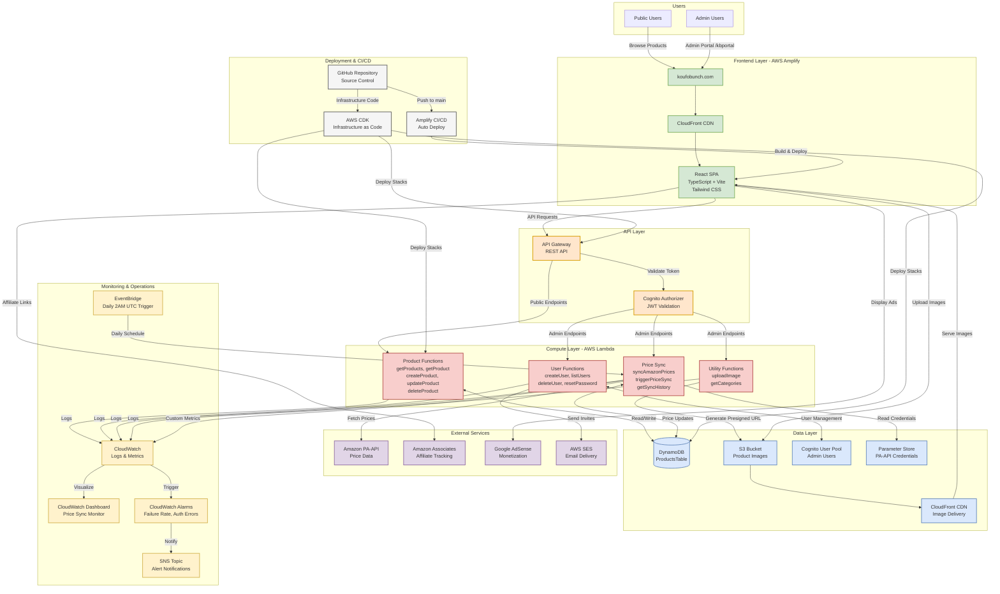

# Pinterest Affiliate Platform - Architecture Diagram

## System Architecture (Mermaid)

## Component Details

### Frontend Layer
- **React SPA**: Modern single-page application with TypeScript
- **CloudFront**: Global CDN for fast content delivery
- **Custom Domain**: koufobunch.com with SSL certificate

### API Layer
- **API Gateway**: RESTful API with CORS support
- **Cognito Authorizer**: JWT-based authentication for admin endpoints

### Compute Layer
- **Product Functions**: CRUD operations for product management
- **User Functions**: Admin user management and authentication
- **Price Sync**: Automated and manual Amazon price synchronization
- **Utility Functions**: Image uploads and category management

### Data Layer
- **DynamoDB**: NoSQL database with GSIs for efficient queries
- **S3 + CloudFront**: Image storage with CDN delivery
- **Cognito User Pool**: Admin authentication and authorization
- **Parameter Store**: Secure credential storage for PA-API

### External Services
- **Amazon PA-API**: Real-time product price data
- **Amazon Associates**: Affiliate link tracking
- **Google AdSense**: Display advertising
- **AWS SES**: Transactional email delivery

### Monitoring & Operations
- **CloudWatch**: Centralized logging and metrics
- **Dashboard**: Real-time price sync monitoring
- **Alarms**: Automated alerts for failures
- **EventBridge**: Scheduled daily price sync trigger

### Deployment & CI/CD
- **GitHub**: Source code version control
- **AWS CDK**: Infrastructure as code in TypeScript
- **Amplify**: Automated frontend deployment

## Data Flow Examples

### Public User Flow
1. User visits koufobunch.com
2. CloudFront serves cached React app
3. App fetches products from API Gateway
4. Lambda queries DynamoDB
5. Products displayed with CloudFront CDN images
6. User clicks affiliate link → Amazon Associates

### Admin Management Flow
1. Admin logs in via Cognito
2. JWT token stored in session
3. Admin creates/updates product
4. API Gateway validates token
5. Lambda updates DynamoDB
6. Images uploaded directly to S3
7. CloudFront serves new images

### Automated Price Sync Flow
1. EventBridge triggers at 2 AM UTC
2. Lambda fetches all products from DynamoDB
3. For each product with ASIN:
   - Call Amazon PA-API
   - Update price in DynamoDB
4. Publish metrics to CloudWatch
5. If failures > 50%, trigger alarm
6. SNS sends alert email

## Quick Reference

### Production URLs
- Website: https://koufobunch.com
- Admin: https://koufobunch.com/kbportal
- API: https://u0xet1m9p1.execute-api.us-east-1.amazonaws.com/prod/

### AWS Resources
- Amplify App: d2zsamo7mttch3
- API Gateway: u0xet1m9p1
- DynamoDB: ProductsTable
- S3 Bucket: pinterest-affiliate-images-788222620487
- Cognito Pool: us-east-1_dgrSfYa3L

---

*This diagram is automatically rendered by GitHub. To edit, modify the Mermaid code above.*
